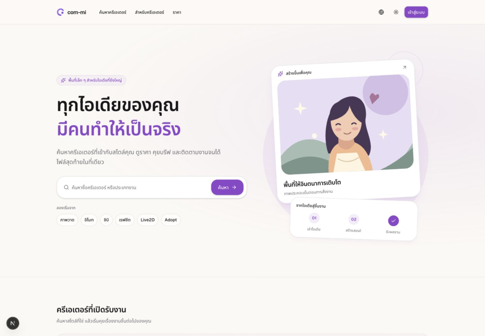

# com-mi — รายงานตรวจระบบและปรับ UI

วันที่ตรวจ: 3 ตุลาคม 2026

## ข้อสรุป

แกน commission มี implementation และ regression tests จำนวนมากแล้ว เหมาะสำหรับเตรียม closed beta หลังปิดรายการ P0 ด้าน environment, นโยบาย, integration/E2E, recovery และ dependency security ยังไม่ใช่การรับรองว่าระบบ production พร้อมขายหรือผ่าน penetration test

แผนดำเนินการอยู่ที่ [PLAN.md](../PLAN.md) แผนนี้ใช้แทนสถานะงานเก่าใน `05-roadmap.md` เมื่อต่างกัน โดยเก็บเหตุผลการออกแบบเดิมไว้อ้างอิง

## ขอบเขตและข้อจำกัด

ตรวจ inventory ของ app routes, components, domain modules, schema/migrations, scripts/configuration และเอกสารเดิม อ่านจุดสำคัญของ auth/authorization, public queries, orders/quotes/invites, payment, delivery/upload, cron, email และ billing รันชุดทดสอบที่ repository มี และตรวจ UI สาธารณะในเบราว์เซอร์

- ไม่ได้ไล่พิสูจน์ทุกบรรทัดหรือทุก SQL transaction ด้วยฐานข้อมูลจำลอง
- ไม่ได้สร้างบัญชี/งาน/รายการโอน ส่งอีเมล หรือเปลี่ยนข้อมูลผู้ใช้จริง
- ไม่ได้เรียก migration, reset/seed หรือ cleanup จริง และไม่แก้ deployment
- ไม่ได้ทดสอบ Google OAuth/OTP end-to-end, PromptPay ผ่านธนาคาร, R2 write/restore หรือหน้าหลังบ้านด้วย session ผู้ใช้
- คำเตือนใน `app/api/cron/cleanup/route.ts` ระบุว่า dev เคยใช้ DB เดียวกับ production จึงถือเป็นความเสี่ยงที่ต้องแยกก่อนทดสอบ mutation; ไม่ได้เปิดเผยค่า secret หรือตรวจยืนยันว่าปัจจุบันยังเป็น DB เดียวกัน
- dependency audit เป็นข้อมูล advisory จาก registry ไม่ใช่หลักฐานว่าเส้นทาง runtime ของเว็บถูกโจมตีได้ทุกกรณี

## สิ่งที่ปรับแล้ว

| ส่วน | เปลี่ยนอะไร | เหตุผล |
|---|---|---|
| Design system | พื้นหลังโทนอุ่น, radius/เงา/กรอบใหม่, ปุ่มหลักใหญ่ขึ้น, ค่าเริ่มต้นธีมตามระบบ | ให้หน้าต่าง ๆ ใช้ภาษาการออกแบบเดียวกัน; เก็บตัวเลือกธีมเดิมของผู้ใช้ |
| Home | hero สองคอลัมน์, illustration ในโค้ด, search เด่น, category chips, empty state ชวนเริ่มใช้ | หน้าไม่มีร้านจริงยังสื่อสารได้ โดยไม่สร้างครีเอเตอร์หรือสถิติปลอม |
| Explore | search panel, heading, filter spacing และ avatar stacking | ค้นหาและอ่านผลได้ชัดบนมือถือ |
| Public navigation | active page และ mobile drawer ปิดเมื่อเลือก link | แก้เมนูที่บังหน้าปลายทางหลังนำทาง |
| Workspace navigation | แบ่งงาน/ร้าน/กำลังพัฒนา, sidebar ค้างตำแหน่งและเลื่อนได้, ชื่อหน้าปัจจุบัน | ลดการปะปนของฟีเจอร์ที่ทำงานได้กับ preview |
| Dashboard | เปลี่ยนกราฟจำลองเป็นทางลัดจริง, แก้หัวข้อยอดรับเงิน, ปรับ empty state/summary | ยอดที่คำนวณจากทุก order ต้องไม่เรียก “รายได้เดือนนี้” |
| Sign-in/onboarding | card และพื้นที่หน้าจอใหม่ | สอดคล้องกับหน้าบ้านและองค์ประกอบร่วม |
| Accessibility | skip link, main focus target, focus-visible, menu label สองภาษา | รองรับการเดินคีย์บอร์ดให้ชัดขึ้น; ยังต้อง screen-reader audit |
| Notification polling | เปรียบเทียบกับ snapshot ล่าสุด, ป้องกัน request ซ้อน, abort เมื่อ unmount, backoff บน non-2xx | ลด request ที่ซ้อนจากกลับเข้าแท็บและเลิกเทียบ state ตอน mount |
| Notification API | private/no-store สำหรับ 304 ด้วย | ให้ cache policy ของข้อมูลส่วนตัวสอดคล้องกัน |
| Cron health | 503 เมื่อ stage ล้ม หรือ report มี errors; ยังคงทำ stage อิสระ | monitoring ไม่ตีความ 200 ว่างานทั้งหมดสำเร็จ |
| Developer workflow | test ผ่าน node import, เพิ่ม typecheck, เพิ่ม GitHub Actions | unit tests รันใน sandbox โดยไม่ต้องเปิด IPC ของ tsx CLI; มีขั้นตรวจมาตรฐาน |
| Environment example | เพิ่ม CRON_SECRET และคำเตือน staging/dry run | ค่า config สำคัญของงานรายวันไม่ตกหล่นจากตัวอย่าง |

ไม่มีการเปลี่ยน state machine, สูตรราคา, PromptPay payload, กฎปล่อยไฟล์ หรือ schema ในรอบนี้

## ประเด็นที่ยังต้องแก้ตามลำดับ

| ID | ระดับ | หลักฐาน | ผลกระทบ/งานถัดไป |
|---|---|---|---|
| A01 | P0 | `app/(marketing)/legal/[doc]/page.tsx` render placeholder | จัดทำ Terms/Privacy จากข้อมูลผู้ดำเนินธุรกิจจริงและให้ผู้เชี่ยวชาญตรวจ ก่อนรับข้อมูลจริง |
| A02 | P0 | ข้อความเตือนเรื่อง shared DB ใน cron และมี seed/reset scripts | ยืนยันและแยก staging; guard คำสั่งอันตราย; ไม่ใช้ production ทดสอบ mutation |
| A03 | P1 | audit หลังแพตช์เหลือ esbuild moderate 1 รายการ; high/critical 0 | ประเมินและอัปเครื่องมือ migration บน staging; ดูตารางด้านล่าง |
| A04 | P0 | suite มี unit/source tests แต่ไม่มี browser E2E config | ทดสอบสิทธิ์หลายผู้ใช้, upload, payment/release และ concurrency กับ DB จริงที่แยกแล้ว |
| A05 | P0 | ไม่พบหลักฐาน restore drill ใน repo | พิสูจน์การกู้ DB + object files และบันทึก RPO/RTO ก่อนใช้กับงานที่มีเงิน |
| A06 | P1 | `lib/email/send.ts` จัดการ error แล้ว return; ไม่พบ durable outbox | request สำเร็จแต่อีเมลอาจหาย; เพิ่ม outbox/idempotency และหน้าติดตามส่งไม่สำเร็จ |
| A07 | P1 | `app/error.tsx` ใช้ console.error; cron ใช้ logs | เพิ่ม alert/heartbeat/correlation และป้องกัน log มีข้อมูลลับ |
| A08 | บล็อกขาย | billing มี plans/limits แต่ไม่มี checkout/webhook route | subscription state, event ledger, reconcile, cancel/refund และ entitlement invalidation |
| A09 | บล็อกขาย | Pro features รวมสิ่งที่หน้า listings/clients/analytics แสดง soon | สร้าง capability matrix แยกสิทธิ์จาก implementation; ขายเฉพาะสิ่งที่ใช้ได้ |
| A10 | P1 | `lib/queries/creator.ts` ใช้การตัดคอลัมน์ลับออก | คอลัมน์ใหม่เสี่ยงไหลไป public; เปลี่ยนเป็น allowlist พร้อม payload regression |
| A11 | P1 | order/thread queries ดึงรายการเต็ม | เพิ่ม pagination เมื่อข้อมูลโต; วัด query plan/latency ก่อนออกแบบ cache |
| A12 | P1 | `vercel.json` รันรายวัน; lifecycle จำกัด candidate ต่อรอบ | วัด backlog/timeout; ตั้ง heartbeat และเกณฑ์เพิ่มรอบ ไม่สัญญาว่าปิดงานตรงวินาที |
| A13 | บล็อกขาย | ราคาประกาศการลดแพ็กเกจ/retention แต่ billing ยังไม่ทำ | ทดสอบ downgrade โดยเฉพาะ upload ไฟล์งานค้างเมื่อเกินโควตา และแก้สัญญาหน้า pricing ให้ตรง |

ระดับนี้ใช้จัดลำดับตามผลกระทบของผลิตภัณฑ์ ไม่ใช่คะแนน CVSS

## Dependency audit

คำสั่ง `pnpm audit --prod --json` สำเร็จ: ก่อนแพตช์พบ 5 advisories (high 2, moderate 2, low 1) จาก 353 dependencies หลังแพตช์และตรวจซ้ำเหลือ **moderate 1, high/critical/low 0** ณ วันที่ตรวจ

| Package ที่พบ | ระดับตาม registry | เส้นทาง | เวอร์ชันแพตช์ที่ registry ระบุ | ข้อพิจารณา |
|---|---|---|---|---|
| nanoid 3.3.17 → 3.3.18 (แก้แล้ว) | High เดิม | next → postcss → nanoid | ≥3.3.18 | custom generator size=0 อาจวนไม่จบ; ต้องตรวจ reachability และแพตช์ |
| undici 6.28.0 → 6.28.1 (แก้แล้ว) | High + Moderate + Low เดิม (3 advisories) | @vercel/blob → undici | ≥6.28.1 | WebSocket DoS/response splitting ตามเงื่อนไข advisory; Blob ใช้ใน migration script ตาม search ปัจจุบัน |
| esbuild 0.18.20 | Moderate | better-auth → drizzle-kit → @esbuild-kit/esm-loader → core-utils → esbuild | ≥0.25.0 | advisory เกี่ยวกับ esbuild development server; อย่าเปิด server นี้ให้เครือข่ายที่ไม่ไว้วางใจ; ทดสอบ compatibility ของเครื่องมือก่อนอัปข้ามช่วง |

อ้างอิง: [nanoid](https://github.com/advisories/GHSA-2v37-7h3g-55p8), [undici WebSocket decompression](https://github.com/advisories/GHSA-3wwx-pv8p-q78v), [undici retry](https://github.com/advisories/GHSA-r53p-7pc4-xj5r), [undici subprotocol](https://github.com/advisories/GHSA-rfgv-xxqx-mfg5), [esbuild](https://github.com/advisories/GHSA-67mh-4wv8-2f99)

**ติดตั้งแพตช์ nanoid และ undici แล้ว** ผ่าน targeted overrides ใน `pnpm-workspace.yaml` และอัป `pnpm-lock.yaml` คู่กัน ไม่รัน package install scripts ระหว่างติดตั้ง คำเตือน 4 รายการนี้ไม่ปรากฏในการ audit รอบสุดท้าย

งานที่ยังค้าง: esbuild 0.18.20 อยู่ในสาย dependency ของเครื่องมือ migration แพตช์ต้องเปลี่ยนข้ามช่วงเวอร์ชัน จึงไม่ override โดยไม่ตรวจ compatibility ก่อน แนะนำอัปต้นทาง drizzle-kit/esm-loader หรือทดสอบ override กับ migration tooling บน staging ห้ามเปิด esbuild development server ให้เครือข่ายที่ไม่ไว้วางใจ ระหว่างนี้บันทึก advisory ว่ายังเปิด ไม่ถือว่า audit ปลอดคำเตือนทั้งหมด

## ผลการตรวจยืนยัน

| รายการ | ผล | ขอบเขต |
|---|---|---|
| Baseline tests | ผ่าน 477/477 | suite เดิมก่อนเปลี่ยน |
| Final tests | ผ่าน 481/481 | เพิ่ม 4 tests สำหรับ cron failure/full/scoped/per-item outcomes |
| ESLint | ผ่าน | โค้ดหลังปรับ |
| TypeScript / route type generation | ผ่าน | `pnpm typecheck` |
| Production build | ผ่านด้วย Webpack | `pnpm build --webpack` ของโค้ดและ dependency สุดท้ายผ่าน; Turbopack รอบแรกผ่าน แต่รอบท้ายติด environment restriction เรื่อง worker port ไม่ใช่ TypeScript error |
| Dependency audit | high/critical 0; moderate 1 | nanoid/undici แพตช์แล้ว; esbuild tooling ยังเปิด |
| Home desktop | ตรวจจริง | 1440px ภาษาไทย/สว่าง; อังกฤษ/มืดตรวจในหน้าต่างเริ่มต้น |
| Home mobile/tablet | ตรวจจริง | 390px ไทย/อังกฤษ และ 768px ไทย ไม่ล้นแนวนอน |
| Explore mobile | ตรวจจริง | 390px, empty result, ค้นหาคำไทยผ่าน query string, clear-filter link |
| Mobile navigation | ตรวจจริง | drawer เปิดได้และปิดเมื่อเลือกหน้า |
| Pricing mobile | ตรวจจริง | 390px, beta/soon แสดงชัด, ไม่ล้นแนวนอน |
| For-creators mobile | ตรวจ DOM จริง | 390px, ไม่ล้นแนวนอน |
| Sign-in mobile | ตรวจจริง | 390px; redirect จาก /dashboard เก็บ next ถูกต้อง; ไม่ส่งข้อมูลล็อกอิน |
| Authenticated workspace/admin | ยังไม่ตรวจ browser ด้วย session | ตรวจ source/types/build; ต้องใช้ staging account สำหรับ integration |
| Payment/QR/R2/email/restore | ยังไม่ยืนยัน live | ไม่มีการโอน/ส่งอีเมล/เปลี่ยนไฟล์หรือข้อมูลจริง |
| CI บน GitHub | เพิ่ม workflow แต่ยังไม่ได้รันบน GitHub | ขั้นตอนทดสอบในเครื่องไม่ใช่หลักฐานว่า remote CI ผ่าน |

ผลนี้ไม่รับประกัน zero bugs, ความปลอดภัยครบทุกเส้นทาง หรือ WCAG conformance การตรวจจริงที่ยังค้างต้องเดินตาม Gate และ test matrix ใน PLAN.md

## ภาพผลลัพธ์

